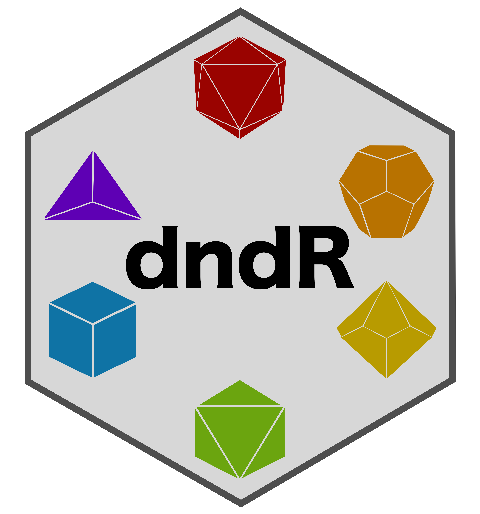

<!-- README.md is generated from README.Rmd. Please edit that file -->



```{r, include = FALSE}
knitr::opts_chunk$set(collapse = TRUE, comment = "#>", fig.path = "man/figures/README-")
```

# dndR

<!-- badges: start -->
[](https://github.com/njlyon0/dndR/actions)
<!-- badges: end -->

The goal of `dndR` is to provide a suite of Dungeons & Dragons (Fifth Edition a.k.a. "5e") related functions.

## Installation

You can install the development version of dndR from [GitHub](https://github.com/) with:

``` r
# install.packages("devtools")
devtools::install_github("njlyon0/dndR")
```

```{r load_packages, echo = FALSE, message = FALSE}
devtools::install_github("njlyon0/dndR")
library(dndR); library(tidyverse)
```

There are several functions currently in `dndR` and I am working on more as we speak!

## Dice Rolling

At its simplest, DnD involves significant amounts of dice rolling and (often) summing their values, so I've scripted a `roll` function! This function supports 'rolling' up to 10 million of any of the standard dice. "Standard" dice include the following numbers of sides: 100, 20, 12, 10, 8, 6, 4, and 2.

```{r roll_fxn}
dndR::roll(dice = '2d20')
dndR::roll('3d6') + dndR::roll('1d4')
```

## Character Creation

I also have a function that can roll for a character's ability scores (strength, dexterity, constitution, intelligence, wisdom, and charisma) given a particular class, race, and preferred method of rolling for ability scores.
```{r pc_creator_fxn}
dndR::pc_creator(class = 'barbarian', race = 'half orc', score_method = "4d6")
```

You can check which classes and races are currently supported by `pc_creator` by running `dnd_classes` or `dnd_races`. If you have a class/race in mind that isn't supported you can [post an Issue](https://github.com/njlyon0/dndR/issues) and I'll add that class/race's stats to the function ASAP!

While waiting for me to act on your Issue, you can run the simpler `ability_scores` function to simply roll for ability scores and manually assign them to specific abilities yourself.
```{r ability_scores_fxn}
dndR::ability_scores(method = "4d6")
```

## Encounter Balancing

When I am the Dungeon/Game Master (DM / GM) I find encounter balancing to be really difficult, in part because of the nest of inter-related tables and experience point multipliers outlined in the Dungeon Master's Guide (DMG) that must be consulted for novice GMs such as myself. To help other newbies, I've created two functions to handle the brunt of this work.

### Experience Point (XP) Thresholds

The difficulty of a fight in DnD is affected by three things: (1) the level of the players' characters, (2) the number of players in the party, and (3) how difficult the GM wants to make things for their players.

The DMG handles this by providing experience point (XP) thresholds based on these three factors. All enemies are worth a pre-determined amount of XP so encounters are balanced by the DMG listing the total XP of all monsters in a given fight for every level of players, party size, and difficulty. That table is useful but a little dense to work through as you're prepping potentially multiple encounters per session, so I created `xp_pool` to handle this.

The number returned by this function represents the amount of XP the GM can 'spend' on monsters in a given encounter to ensure the difficulty is as desired.
```{r xp_pool_fxn}
dndR::xp_pool(party_level = 2, party_size = 4, difficulty = "medium")
```

### XP Multipliers

While the XP pool is crucial to know while designing an encounter, it does fail to account for the effect of the number of enemies. A fight versus a single monster worth 1000 XP is a very different proposition than one against four creatures each worth 250 XP even though the total XP is the same.

The DMG accounts for this eventuality by providing XP multipliers based on the number of monsters and the number of players. The same total monster XP is multiplied by a larger value for more monsters facing a smaller party than it would be for fewer monsters facing a larger party.

When using the XP threshold for a given encounter (as identified by `xp_pool`) the GM must pass their selected monsters' total XP through this multiplier table to identify the true 'cost' to compare against their pool (to identify whether their encounter will be the desired level of difficulty.) See why I wanted to write functions to do this for me? Enter `xp_cost`!

This function takes the total XP of the monsters you (the GM) have selected, the number of monsters that make up that total, and the size of your party and returns the true XP cost of the encounter for comparison with the threshold identified by `xp_pool`.
```{r xp_cost_fxn}
dndR::xp_cost(monster_xp = 1000, monster_count = 2, party_size = 3)
```

### Quick XP Demonstration

Let's say I am running a game for four players, all level 3, and I want to design a hard encounter for them. This is how I would go about doing that using `dndR`:

To begin, I'd identify the total XP I can 'spend' to make an encounter this difficult.
```{r xp_demonstration_1}
dndR::xp_pool(party_level = 3, party_size = 4, difficulty = 'hard')
```

Now that I know how much XP I can 'spend' I can check the value of two monsters worth (total) 500 XP against that threshold.
```{r xp_demonstration_2}
dndR::xp_cost(monster_xp = 500, monster_count = 2, party_size = 4)
```

I can see that I'm well under the XP threshold I have to play with so I can add a monster and see where that leaves me.
```{r xp_demonstration_3}
dndR::xp_cost(monster_xp = 500, monster_count = 3, party_size = 4)
```

Really close! What if I added another monster that isn't worth as much XP?
```{r xp_demonstration_4}
dndR::xp_cost(monster_xp = 550, monster_count = 4, party_size = 4)
```

Basically right on target! I can now pick out my four monsters that total up to 550 XP raw and know that they will likely* make a hard encounter for my players! (* "Likely" because there is dice rolling involved and it is possible the monters roll well while my players roll badly or vice versa).

## Creating Monsters

Creatures that you create can be a great way to add flavor to an encounter of can form the centerpiece of a larger campaign arc! I have provided two functions to help provide a starting place for DMs in creating your own monsters: `monster_stats` and `monster_creator`.

### Finding Official Monster Statistics with `monster_stats`

The Dungeon Master's Guide (DMG) provides a table (see p. 274) that gives the core vital statistics for creatures based on their Challenge Rating (CR) but this table can be cumbersome to compare to Experience Points (you know, the things used to determine how hard an encounter will be for your party?). `monster_stats` streamlines this process by allowing you to input either the XP you want to spend on this creature (you can use the value returned by `xp_cost`) *or* the Challenge Rating (CR) if you know it. Note that if you specify both XP and CR, the function will ignore XP and proceed with CR alone. **Once either XP or CR is provided, the function returns the creatures statistics as they appear in the DMG for a creature of that difficulty.**

```{r monster_stats_fxn1}
dndR::monster_stats(xp = 1000, cr = 4)
```

Challenge Rating is more than a little esoteric so feel free to ignore that argument entirely if XP is more comfortable for you!
```{r monster_stats_fxn2}
dndR::monster_stats(xp = 8000)
```

### Homebrewing Custom Monsters with `monster_creator`

If you'd rather take a more customized approach, you can use `monster_creator` instead of `monster_stats`. This function follows the advice of [Zee Bashew](https://twitter.com/Zeebashew) on how to build interesting, challenging monsters for your party. These monsters are built somewhat according to the Dungeon Master's Guide for creating monsters, partly Zee's [YouTube video on homebrewing monsters based on The Witcher videogame](https://www.youtube.com/watch?v=GhjkPv4qo5w), and partly on my own sensibilities about scaling the difficulty of a creature. Creatures are spawned randomly so you may need to re-run the function several times (or mentally modify one or more parts of the output) to get a monster that fits your campaign and players. Each creature is provided with up to five damage resistances, up to two damage immunities, and a single vulnerability. This combination allows you to build complex and mysterious homebrew monsters with plenty of opportunities for the party to have to investigate around to discover the monster's strengths and weaknesses before the final showdown.

```{r, monster_creator}
dndR::monster_creator(party_level = 5, party_size = 4)
```

## `dndR` versus DMG Comparisons

See below for some comparisons between my functions and the Dungeon Master's Guide statistics they recapitulate.

### `xp_pool` vs. DMG

The DMG specifies the XP threshold *per player* for a given difficulty while my function asks for the *average* player level and the party size to avoid becoming simply a querying function for the DMG's table.

I calculated the formula for the relationship between XP and player level and used that calculation in lieu of embedding the DMG's table in my function. This has the added benefit of being able to handle non-integer values for average party_level. Below is a comparison of the DMG's XP-to-player level curve and the one obtained by `xp_pool`.

```{r xp_dmg-to-pool_comparison, echo = FALSE, out.width = '50%',fig.align = 'center', warning = FALSE}
# Assemble a dataframe showing the DMG's party level versus easy encounter XP
xp_df <- data.frame('pc_level' = 1:20,
                   'easy_xp' = c(25, 50, 75, 125, 250, 300, 350, 450, 550, 600,
                                 800, 1000, 1100, 1250, 1400, 1600, 2000, 2100,
                                 2400, 2800)) %>%
  # For each row...
  dplyr::rowwise() %>%
  # Calculate the XP for that party level using my function
  dplyr::mutate(calc_xp = dndR::xp_pool(party_level = pc_level,
                                         party_size = 1,
                                         difficulty = 'easy')) %>%
  # Rename a column more intuitively
  dplyr::rename(book_xp = easy_xp) %>%
  # Pivot longer for ease of plotting
  tidyr::pivot_longer(cols = -pc_level, names_to = 'calc_method', values_to = 'xp') %>%
  # Change the entries of the calc_method column
  dplyr::mutate(authority = base::ifelse(test = calc_method == "book_xp",
                                         yes = "DMG", no = "dndR"))
# Create the plot
ggplot2::ggplot(xp_df, aes(x = pc_level, y = xp,
                           color = authority, shape = authority))  +
  geom_smooth(method = 'loess', formula = 'y ~ x', se = FALSE) +
  geom_point(size = 3, pch = rep(x = c(17, 19), times = 20),
             position = position_dodge(width = 0.5)) +
  labs(x = "Party Level", y = "Experience Points (XP)") +
  scale_color_manual(values = c("#f46d43", "#74add1")) +
  theme_classic() +
  theme(legend.position = c(0.1, 0.9),
        legend.title = element_blank(),
        axis.text.y = element_text(angle = 90, hjust = 0.5),
        axis.text = element_text(size = 14),
        axis.title = element_text(size = 16))
```


### `cr_convert` vs. DMG

The DMG specifies the XP value of a monster of any challenge rating (CR) from 0 to 30. I calculated the formula for this parabola (actually two formulas; one for above and one for below a CR of 20) and coded it into `cr_convert` to calculate it. This is pre-requisite to my idea of a 'monster creator' function as it allows users to specify either CR or XP value of a monster to inform that function. Below is the comparison of the DMG's XP-to-CR curve and the one produced by `cr_convert`. Note that `cr_convert` is a helper function invoked in `monster_stats` to convert from CR to XP (done internally in that function).

```{r cr_dmg-to-convert_comparison, warning = FALSE, message = FALSE, echo = FALSE, out.width = '50%', fig.align = 'center'}
# Assemble a dataframe showing the DMG XP to CR relationship
cr_actual <- data.frame(
  "cr" = c(0, 0.125, 0.25, 0.5, 1:30),
  "dmg_xp" = c(0, 25, 50, 100, 200, 450, 700, 1100, 1800, 2300, 2900,
           3900, 5000, 5900, 7200, 8400, 10000, 11500, 13000, 15000,
           18000, 20000, 22000, 25000, 33000, 41000, 50000, 62000,
           75000, 90000, 105000, 120000, 135000, 155000) ) %>%
  # For each row...
  dplyr::rowwise() %>%
  # Calculate XP for a given CR using `cr_convert`
  dplyr::mutate("calc_xp" = dndR::cr_convert(cr = cr)) %>%
  # Pivot to long format
  tidyr::pivot_longer(cols = dplyr::contains('_xp'),
                      names_to = "authority",
                      values_to = "xp") %>%
  # And clean up the entries of the source column
  dplyr::mutate(source = base::ifelse(test = (authority == "calc_xp"),
                                      yes = "dndR", no = "DMG"))
  
# Creat the plot comparison
ggplot(cr_actual, aes(x = cr, y = xp, color = source, shape = source)) +
  geom_smooth(formula = 'y ~ x', method = 'loess', se = F) +
  geom_point(size = 3, pch = rep(x = c(17, 19), times = 34),
             position = position_dodge(width = 0.5)) +
  labs(x = "Challenge Rating (CR)", y = "Experience Points (XP)") +
  scale_color_manual(values = c("#c51b7d", "#4d9221")) +
  theme_classic() +
  theme(legend.position = c(0.15, 0.9),
        legend.title = element_blank(),
        axis.text.y = element_text(angle = 90, hjust = 0.5),
        axis.text = element_text(size = 14),
        axis.title = element_text(size = 16))
```

## Looking Ahead

I'm working on a function to help stat out monsters/creatures based on challenge rating (CR) and will update this README when it/they are ready!

If you have other function ideas, post them as Issues on this repository!
