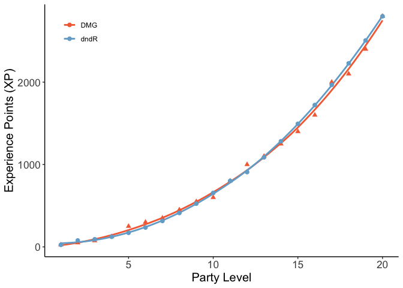

<!-- README.md is generated from README.Rmd. Please edit that file -->

# dndR

<!-- badges: start -->

[](https://github.com/njlyon0/dndR/actions)
<!-- badges: end -->

The goal of `dndR` is to provide a suite of Dungeons & Dragons (Fifth
Edition) related functions.

## Installation

You can install the development version of dndR from
[GitHub](https://github.com/) with:

``` r
# install.packages("devtools")
devtools::install_github("njlyon0/dndR")
```

## Current Functions (Players and GMs)

There are several functions currently in `dndR` and I am working on more
as we speak!

### Dice Rolling

At its simplest, DnD involves significant amounts of dice rolling so
I’ve scripted dice functions! These functions support dice with the
following numbers of sides: 100, 20, 12, 10, 8, 6, 4, and 2 (2 is
essentially a coin so `coin()` is also a function).

``` r
# Twenty-sided dice
dndR::d20()
#> [1] 9

# Eight-sided dice
dndR::d8()
#> [1] 6

# Flip a coin
dndR::coin()
#> [1] 2
```

That said, this is somewhat cumbersome given that DnD mostly involves
rolling *multiple* dice and summing their outcomes so the `roll()`
function is built to handle these more general cases

``` r
dndR::roll(what = '2d8')
#> [1] 7

dndR::roll('3d6') + dndR::roll('1d4')
#> [1] 13
```

### Character Creation

You can also roll for your character’s six ability scores by summing
four d6 and dropping the lowest value, rolling three d6, or (for the
truly wild) rolling only a d20.

``` r
dndR::ability_scores(method = "4d6")
#>   ability score
#> 1      V1    14
#> 2      V2    15
#> 3      V3    10
#> 4      V4    13
#> 5      V5    16
#> 6      V6    16
```

That method allows for manual specification of which ability scores
should go to each roll but you could also assign them based on the
Player’s Handbook’s (PHB’s) recommendations for various classes.

``` r
dndR::class_block(class = 'wizard', score_method = "4d6")
#>   ability score
#> 1     STR    10
#> 2     DEX    12
#> 3     CON    17
#> 4     INT    17
#> 5     WIS    13
#> 6     CHA    10
```

DnD races (e.g., dwarves, dragonborn, etc.) confer additional points to
specific abilities and there’s a function for that as well!

``` r
dndR::race_mods(race = 'wood elf')
#>   ability modifier
#> 1     STR        0
#> 2     DEX        2
#> 3     CON        0
#> 4     INT        0
#> 5     WIS        1
#> 6     CHA        0
```

Finally, you could create a character of specified race and class in one
fell swoop!

``` r
dndR::pc_creator(class = 'barbarian', race = 'half orc', score_method = "4d6")
#> Total score very low. Consider re-rolling?
#>   ability raw_score race_modifier score roll_modifier
#> 1     STR        14             2    16            +3
#> 2     DEX        13             0    13            +1
#> 3     CON        13             1    14            +2
#> 4     INT         9             0     9            -1
#> 5     WIS         8             0     8            -1
#> 6     CHA        10             0    10             0
```

## Current Functions (GMs)

I’ve also designed some functions to help other GMs in developing
encounters. It can be very difficult to balance encounter difficulty
appropriately so I’ve begun to write functions that (hopefully) make it
a little easier to navigate the opaque difficulty, challenge rating, and
experience point systems outlined in the Dungeon Master’s Guide (DMG).

The first such function is `xp_total()` and it identifies the total
experience points of all creatures given a party level (average of PCs
level in party) and a desired difficulty level (easy, medium, hard, or
deadly). GMs can use this value to “buy” creatures/monsters based on
their XP until the pool is exhausted to ensure their encounters are the
desired level of difficulty for the specified party.

``` r
dndR::xp_total(party_level = 3, difficulty = 'medium')
#> [1] 185
```

Here is a comparison of the total XP for an easy encounter recommended
in the DMG versus the XP calcualted by `dndR::xp_total()` for the same
difficulty of encounter.



## Looking Ahead

I’m working on a function to help stat out monsters/creatures for
various challenge ratings (“CR”) and will update this README when
it/they are ready!

If you have other function ideas, post them as Issues on this
repository!
