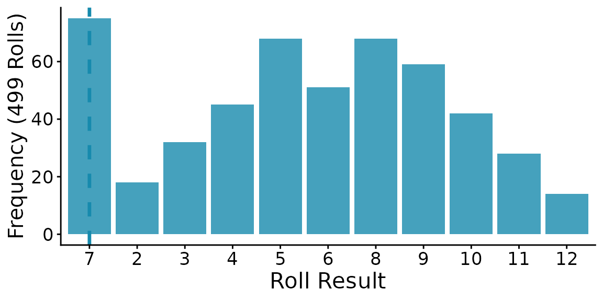
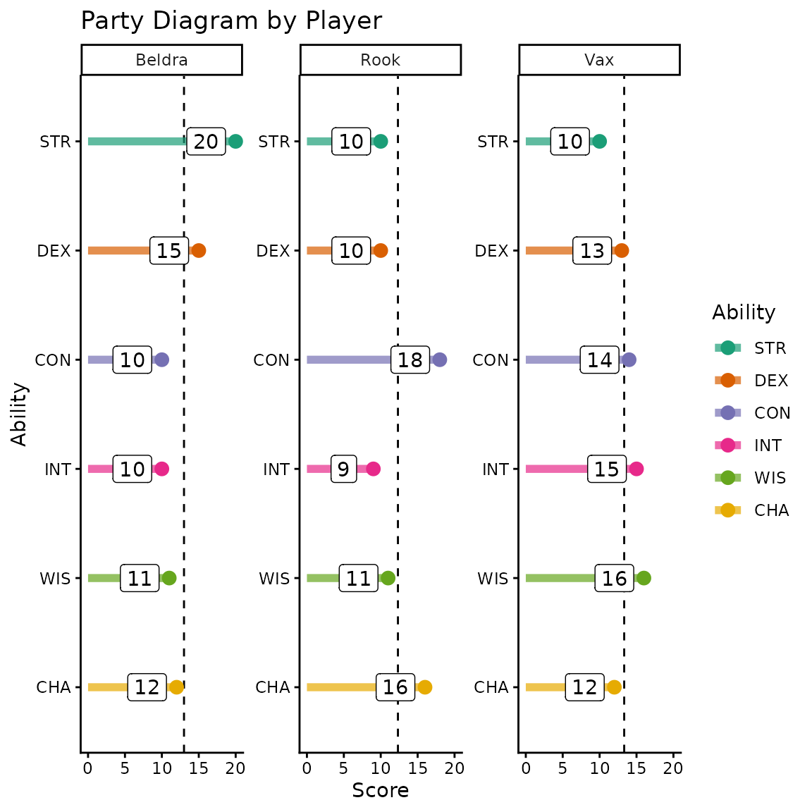
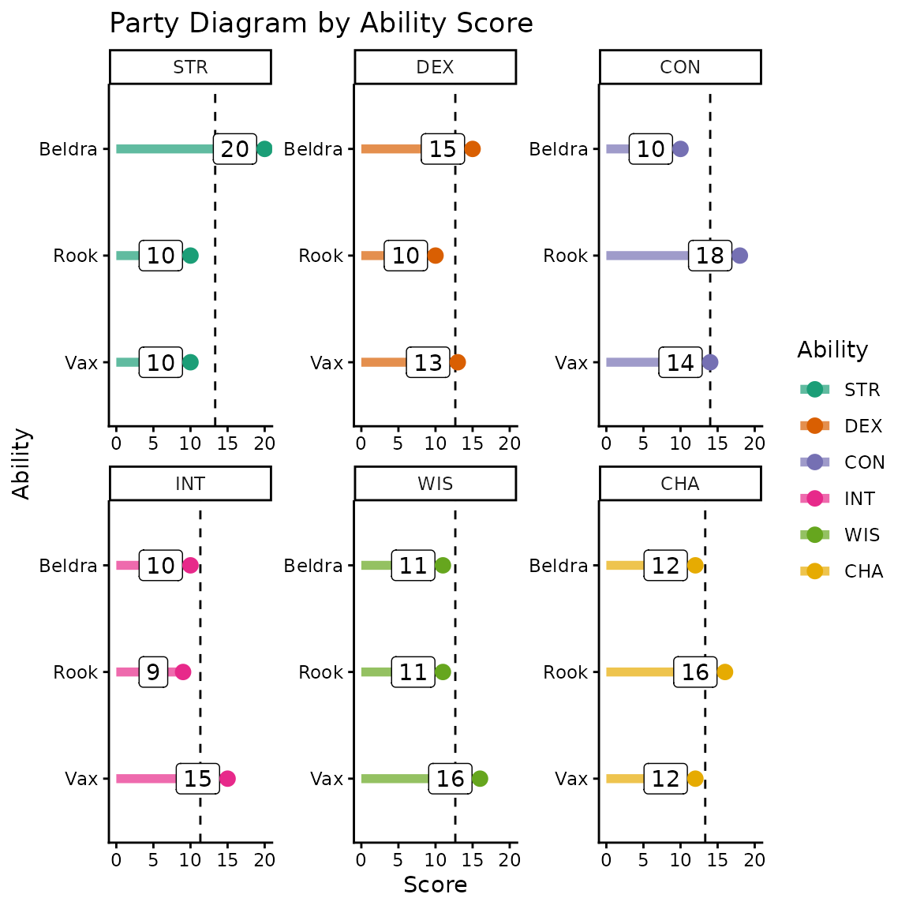

# Visual Tools

## Dice Rolling Probabilities

If you’d like to visualize the probable outcomes of rolling some number
of dice of a specified type, `probability_plot` is here for you! You can
specify the number and type of dice and the number of times to roll that
group. The median outcome is indicated by a dashed vertical line.

``` r
# Make a probability plot for two, six-sided dice
dndR::probability_plot(dice = "2d6", roll_num = 499)
```



Just for fun, the graph colors are decided by the type of dice you
specify and correspond to the hex logo of this R package!

## Assessing Party Abilities

It can be useful as a DM to know where your players’ strengths and
weaknesses lie across the whole party. `party_diagram` allows DMs to
visualize the ability scores of every player in a party either grouped
by player or by ability score. The function supports both interactive
(abilities entered via the R Console) and non-interactive (abilities
given as a list) entries.

Thank you to [Tim Schatto-Eckrodt](https://kudusch.de/) for contributing
this function!

Due to the static nature of a vignette, we’ll use the non-interactive
path by assembling the party score list and then invoking this function.

``` r
# Create named list of PCs and their scores
party_list <- list(Vax = list(STR = "10", DEX = "13", CON = "14", 
                              INT = "15", WIS = "16", CHA = "12"),
                   Beldra = list(STR = "20", DEX = "15", CON = "10",
                                 INT = "10", WIS = "11", CHA = "12"),
                   Rook = list(STR = "10", DEX = "10", CON = "18", 
                               INT = "9", WIS = "11", CHA = "16"))

# Create a party diagram using that list (by player)
dndR::party_diagram(by = "player", pc_stats = party_list, quiet = TRUE)
```



You can also group the diagram by ability score if that is of interest
instead.

``` r
# Party diagram grouped by ability score
dndR::party_diagram(by = "ability", pc_stats = party_list, quiet = TRUE)
```


