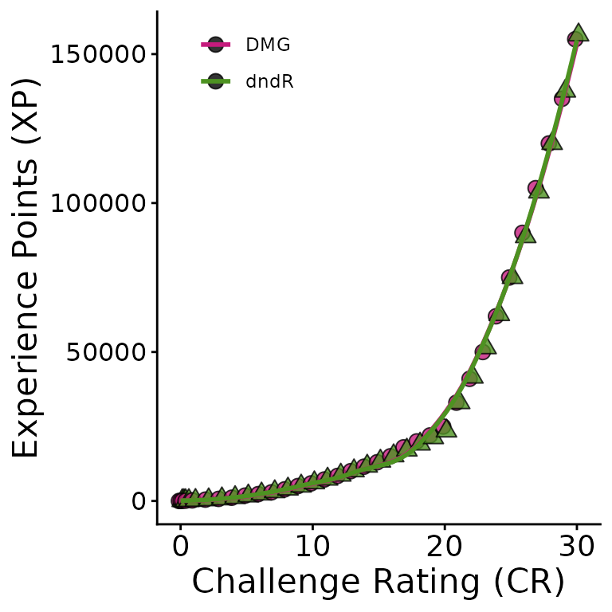
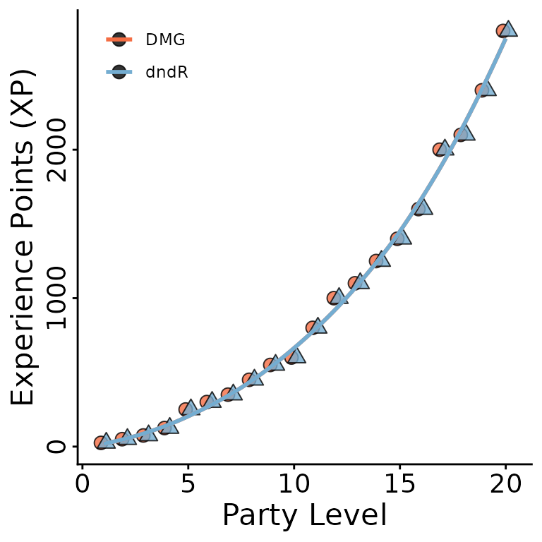

# DMG versus dndR

## `dndR` versus DMG Comparisons

See below for some comparisons between my functions and the Dungeon
Master’s Guide statistics they attempt to recapitulate.

### `cr_convert` vs. DMG

`cr_convert` is embedded in the `monster_stats` function and is what
allows that function to handle both CR and XP inputs. The DMG specifies
the XP value of a monster of any CR from 0 to 30 so `cr_convert` uses
the formula of that line to avoid querying the table for this
conversion.

Below is the comparison of the DMG’s XP-to-CR curve and the one produced
by `cr_convert`.

### `xp_pool` vs. DMG

The DMG specifies the XP threshold *per player* for a given difficulty
while my function asks for the *average* player level and the party
size. This difference keeps the function streamlined and flexible for
parties of any size. If average party level is an integer, the DMG’s
table for the encounter XP to player level is used. Otherwise, `xp_pool`
uses the formula for the line defining the XP-party level curve implicit
in the DMG’s table. This has the benefit of being able to handle parties
where not all players are the same level.

Below is a comparison of the DMG’s XP-to-party level curve versus the
one obtained by `xp_pool`.

