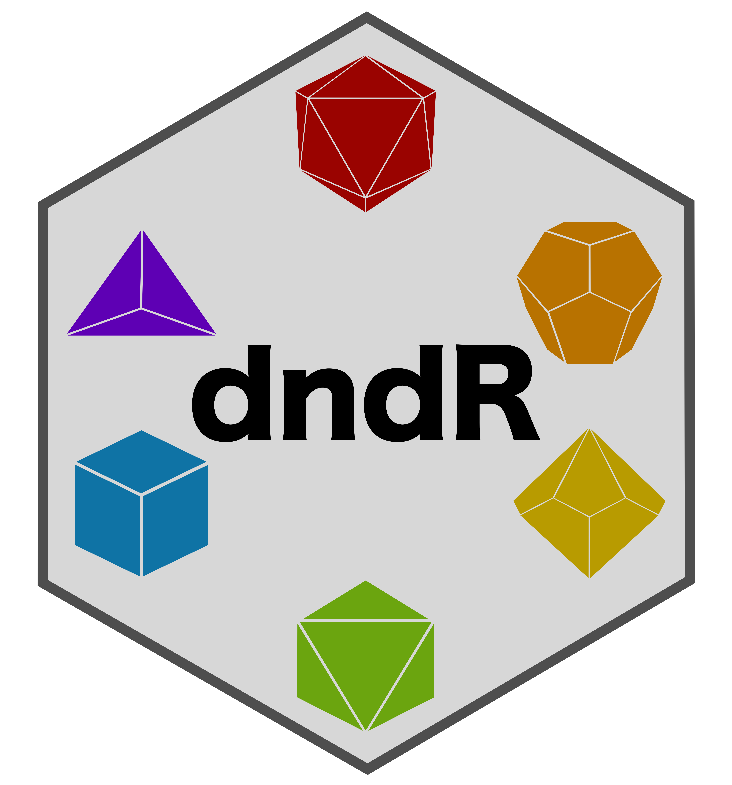

# `dndR`: Dungeons & Dragons Functions for Players and Dungeon Masters



The goal of `dndR` is to provide a suite of Dungeons & Dragons (Fifth
Edition a.k.a. “5e”) related functions to help both players and Dungeon
Masters (DMs). Check out the package website
([njlyon0.github.io/dndR](https://njlyon0.github.io/dndR/)) for
documentation of the functions currently included in the package. I am
always willing to expand that list though so if you have a D&D-related
task that could be cool as a function, please [review the contributing
guidelines](https://njlyon0.github.io/dndR/CONTRIBUTING.html) on how to
share your idea!

## Installation

You can install the development version of `dndR` from
[GitHub](https://github.com/) with:

``` r
# install.packages("devtools")
devtools::install_github("njlyon0/dndR")
```

## Contributing to `dndR`

If you’d like to contribute function scripts or ideas, that is more than
welcome! Please check out the [contributing
guidelines](https://njlyon0.github.io/dndR/CONTRIBUTING.html) and follow
the instructions described there.

### Package Contributors

- [Tim Schatto-Eckrodt](https://kudusch.de/) contributed the
  `party_diagram` function
- [Humberto Nappo](https://orcid.org/0000-0001-7810-1635) contributed
  the idea for the `pc_level_calc` function
- [Billy Mitchell](https://wj-mitchell.github.io/) contributed the
  vectors of names used to expand the `npc_creator` function
